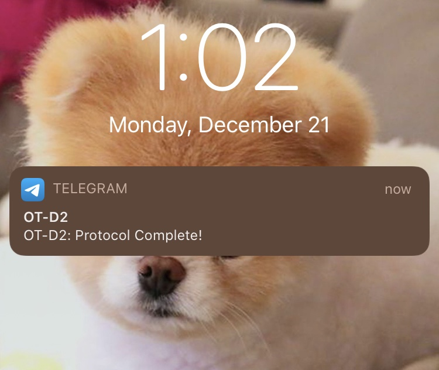

# OT2 Telegram Notifications

OT2 Telegram Notifications allows you to send notifications to your phone via Telegram during a protocol run on the Opentrons robot. This is useful for long protocols or protocols with multiple steps by keeping the user informed. It can also be useful in keeping track of runs. 

NOTE: This is not officially supported by Opentrons and is experimental. Use at your own risk.
## Instructions

1. Install Python 3.7.6 or higher on your system.
2. Install the `requests` package using `pip install requests`
2. Setup the Opentrons package for simulating the Python API on your machine: [Installation Instructions Here](https://docs.opentrons.com/v2/writing.html#simulating-python-protocols)
3. Create a Telegram bot in order to acquire a **bot token** [Bot Creation Instructions Here](https://core.telegram.org/bots#6-botfather)
4. Create a new group chat on Telegram with your bot to receive notifications (You can add multiple users so everyone can see notifications).
5. Get the **chat ID** for the group chat by visiting the following endpoint in your browser `https://api.telegram.org/bot<BOTToken>/getUpdates` (replace BOTToken with the token you acquired earlier).

Inside of the run() function of your protocol you can define variables with your bot token and chat IDs.
```
    token = "Bot Token Here"
    bot_chatIDs = ["Chat ID Here"]
```

You can add the following function within the run() function to make an API call via Telegram.
```
def sendtext(bot_message):
        for chatID in bot_chatIDs:
            http_req = 'https://api.telegram.org/bot' + token + '/sendMessage?chat_id=' + chatID + '&parse_mode=Markdown&text=' + bot_message
            response = requests.get(http_req)
```

You can now use the `sendtext()` function throughout your protocol to send yourself Telegram notifications.
Example:
```
sendtext("Protocol Complete!")
```




## Running Protocols on Your OT-2
There are a few additional steps in order to run your actual protocols with Telegram notifications on your OT-2. You will need to setup SSH access and install the `requests` package on your OT-2.

1. Setup SSH access on your server: [SSH Access Instructions](https://support.opentrons.com/en/articles/3203681-setting-up-ssh-access-to-your-ot-2)
2. Connect to your OT-2 via SSH: [Connecting via SSH](https://support.opentrons.com/en/articles/3287453)
3. At this step you should be connected via SSH. Install the requests package: `pip install requests`
4. Your OT-2 may require a restart before you can test your protocol using the Opentrons App.
